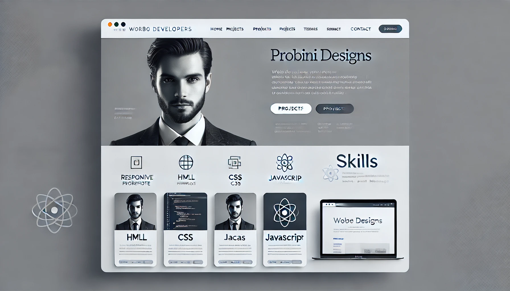

# Portfolio website II
 This portfolio website showcases my skills, projects, and services as a web developer. It highlights a clean and responsive design tailored to create a professional impression and ensure a seamless user experience across devices. The website includes sections for Home, Projects, Services, and Contact Information.

The design prioritizes user-first principles, accessibility, and modern web standards to deliver visually appealing and functional web pages.

# Features
- Responsive Design: Fully responsive and optimized for desktop, tablet, and mobile devices.
- Interactive Navbar: Hamburger menu for easy navigation on smaller screens.
- Skills Section: Visual cards showcasing technical expertise in HTML, CSS, JavaScript, and React.
Contact Links: Includes email, phone, and social media platforms.

# Technologies Used
- Frontend Framework: React
- Styling: Custom CSS with Bootstrap integration
- Icons: Font Awesome
- Responsive Design: Media queries
- Additional Packages: hamburger-react for a functional hamburger menu

## Preview

<!-- npm run build
npm run dev -->